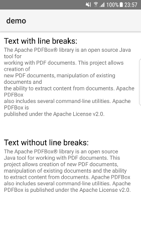

# NativeScript PdfBox  

[](https://travis-ci.org/svzi/nativescript-pdfbox)

Apache Pdfbox for NativeScript. This plugin allows you to extract the text from a PDF file.



The screenshot is based on the [sample.pdf](demo/app/sample.pdf) included in the demo project.

Based on:

- Android [PdfBox-Android](https://github.com/TomRoush/PdfBox-Android)

The plugin is currently only avaiable for Android. 


## Installation

```bash
tns plugin add nativescript-pdfbox
```

## Usage 
	
```javascript
import * as fs from 'tns-core-modules/file-system';
import { PdfBox } from 'nativescript-pdfbox';

const appPath = fs.knownFolders.currentApp().path;
const mySampleFile = appPath + '/sample.pdf';
const removeLineBreaks: boolean = true; // optional, default is false

const pdfbox: PdfBox = new PdfBox();
pdfbox
    .getText(mySampleFile, removeLineBreaks)
    .then(text => {
        this.messageNotRemovedLB = text;
        super.notifyPropertyChange('messageNotRemovedLB', text);
    });
```
  
## License

Apache License Version 2.0, January 2004
